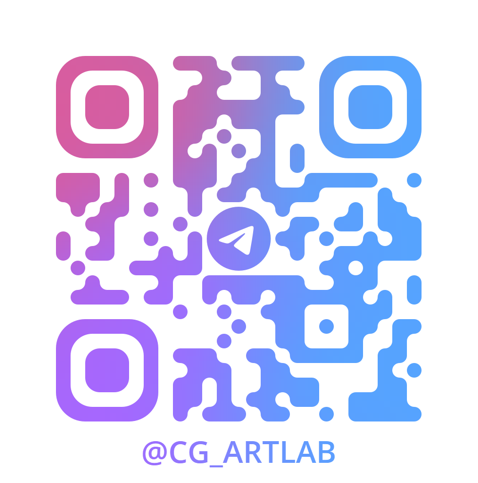

## 🎨 About Me

I specialize in **CG art**, **3D visualization**, and **creative technology**.

Through my blog, I share insights on productivity tools, design workflows, and technical tutorials. I hope to help fellow creators optimize their creative process and explore new possibilities in digital art and technology.

---

<!-- BLOG_POSTS_START -->
## 📝 Latest Blog Posts / 最新博客文章

*Last Updated: 2026-03-21 01:03:47*

**1.** [14 玄光周刊\-当AI开始记住你的一切，这是我的使用策略](https://cgartlab.com/posts/weekly-14/) - *2026-03-20*

**2.** [世界尽管让它去转，不用担心你学的东西会过时](https://cgartlab.com/posts/dont-worry-what-your-learning-will-pass/) - *2026-03-08*

**3.** [13 玄光周刊\-你和AI聊过的天，可能并不属于你](https://cgartlab.com/posts/weekly-13/) - *2026-02-05*

**4.** [12 玄光周刊\-「左脚踩右脚」的创作方法](https://cgartlab.com/posts/weekly-12/) - *2026-02-03*

**5.** [就算掌声无法抵达舞台，我依然劝你尽快动笔](https://cgartlab.com/posts/pick-your-pencil-now/) - *2026-01-31*

<!-- BLOG_POSTS_END -->

---

## 📢 Where to Find Me

<table align="left">
<tr>
<td align="center" height="120%">
   
</td>
<td align="center" height="120%">
   
</td>
</tr>
</table>
