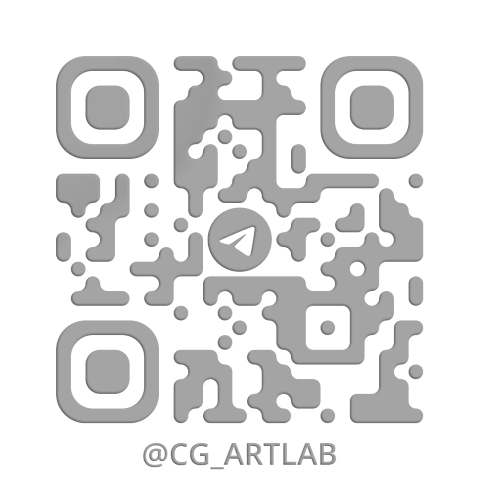

## About 

I'm a [Motion visual designer](https://cgartlab.com/works), [Content creator](https://cgartlab.com/), Product engineer from China.

I explore the intersection of Design, AI, Knowledge Management, and Automation, building tools and workflows that help creators work more efficiently.

<!-- BLOG_POSTS_START -->
## 📝 Latest Blog Posts / 最新博客文章

*Last Updated: 2026-07-25 09:31:32 UTC*

- [我的上帝模式，一名设计师创作环境的演变](https://cgartlab.com/posts/designer-creative-environment-evolution/) — 2026-07-21
- [自动给文章术语加百科链接，这个方案一分钟搞定](https://cgartlab.com/posts/auto-glossary-term-linking/) — 2026-06-28
- [EDIC设计系统](https://cgartlab.com/posts/edic-design-system/) — 2026-06-08
- [我常用的 OpenClaw 工作流 Skill \- No\.18 玄光周刊](https://cgartlab.com/posts/weekly-18/) — 2026-05-24
- [从黑苹果到独立博客，这是我的开源旅程 \- No\.17玄光周刊](https://cgartlab.com/posts/weekly-17/) — 2026-05-02
<!-- BLOG_POSTS_END -->

## Contact 

  
  &nbsp;&nbsp;&nbsp;
  

WeChat: cgartlab-com | Telegram: <a href="https://t.me/cgartlab">@cgartlab</a>

