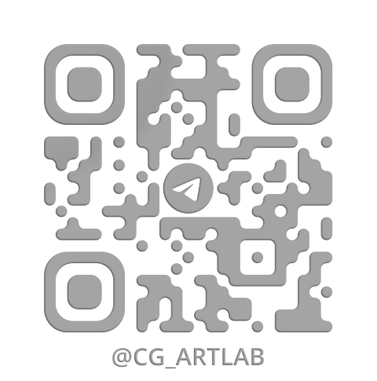

## About 

I'm a [Motion visual designer](https://cgartlab.com/works), [Content creator](https://cgartlab.com/), [Product engineer](https://github.com/cgartlab) from China.

I explore the intersection of Design, AI, Knowledge Management, and Automation, building tools and workflows that help creators work more efficiently.

<!-- BLOG_POSTS_START -->
## 📝 Latest Blog Posts / 最新博客文章

*Last Updated: 2026-10-08 15:05:24 UTC*

- [设计中的通杀概念 \- No\.23](https://cgartlab.com/posts/weekly-23/) — 2026-10-07
- [人人可用的互联网基础设施 \- No\.22](https://cgartlab.com/posts/weekly-22/) — 2026-10-03
- [为什么没感觉到 AI 让你变快？\- No\.21](https://cgartlab.com/posts/weekly-21/) — 2026-09-27
- [文字内容创作的形式 \- No\.20](https://cgartlab.com/posts/weekly-20/) — 2026-09-11
- [《奥德赛》，客制化 Agent，以及那些真正解决麻烦的 Skill · No\.19](https://cgartlab.com/posts/weekly-19/) — 2026-08-31
<!-- BLOG_POSTS_END -->

## Contact 

  
  &nbsp;&nbsp;&nbsp;
  

WeChat: cgartlab-com | Telegram: <a href="https://t.me/cgartlab">@cgartlab</a>

